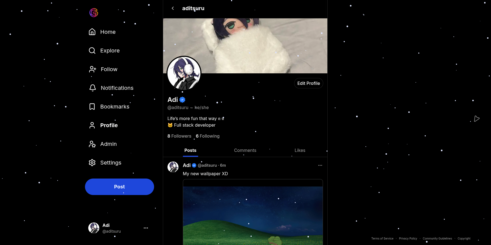

# Glimpse

<div align="left">

[][stars-url]
[][discord-url]


</div>

<div align="center">



</div>

<!-- demo link here -->

Glimpse is a social platform built around an algorithmic feed that surfaces content based on engagement and recency. Posts support Markdown, mentions, embeds, and media carousels. Engagement — likes, comments, views, bookmarks — is tracked in real time, with view counts batched through Redis and flushed asynchronously to keep the database load minimal.
The feed is personalized per user, excludes already-seen content, and degrades gracefully when new content runs out. Authentication is handled with email verification enforced at the route group level, with custom logic to keep the flow flexible without being permissive.

> [!NOTE]
> Backend complete. Frontend in progress.

### Tech Stack

#### Frontend

[](https://nextjs.org)
[](https://www.typescriptlang.org)
[](https://tailwindcss.com)


#### Backend


[](https://better-auth.com)

#### Database & Cache

[](https://www.postgresql.org)
[](https://orm.drizzle.team)
[](https://redis.io)

#### Storage

[](https://aws.amazon.com/s3)

### Features

- Algorithmic feed with time-decay ranking
- Cursor-based infinite scroll
- 1-level nested comments with mentions
- Rich posts — Markdown, embeds, image/GIF/video carousels
- Likes, bookmarks, followers
- Direct-to-S3 file uploads via presigned URLs
- Email verification flow with custom route group logic

### How the Feed Works

Posts are ranked by a decay formula borrowed from Hacker News:

```
Score = (P - 1) / (T + 2)^1.8
```

Where `P` is an engagement score `(Likes × 2) + (Comments × 5) + Views`, and `T` is the post's age in hours. Older posts naturally drop in priority.

Each user's seen posts are tracked in Redis as a sorted set, scored by timestamp. The feed excludes already-seen posts and falls back to the oldest seen posts once the unseen pool is exhausted.

View tracking is batched — counts are written to Redis on scroll and flushed to the database by a cron job.

### What I Learned

- Designing cursor-based pagination for social data and why offset pagination breaks on live feeds
- How Redis sorted sets work and using them for efficient, time-ordered seen-post tracking
- Presigned URL pattern for direct browser-to-S3 uploads
- Managing auth route groups with custom middleware instead of relying on library defaults
- Structuring an oRPC API with consistent return types and shared pagination contracts

[stars-url]: https://github.com/aditsuru/glimpse/stargazers
[discord-url]: https://discord.gg/HP2YPGSrWU
