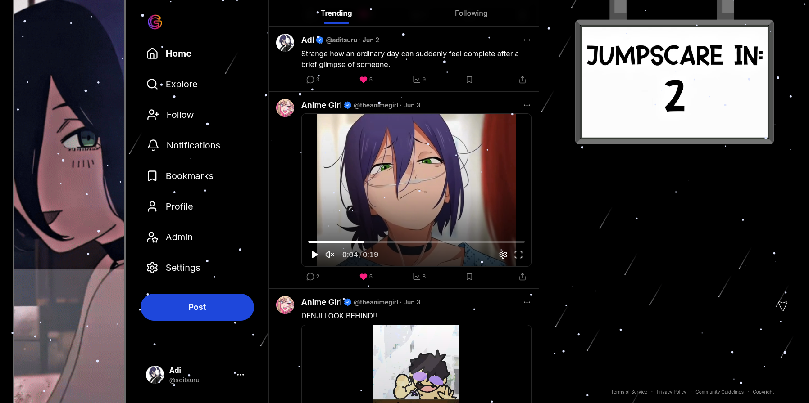
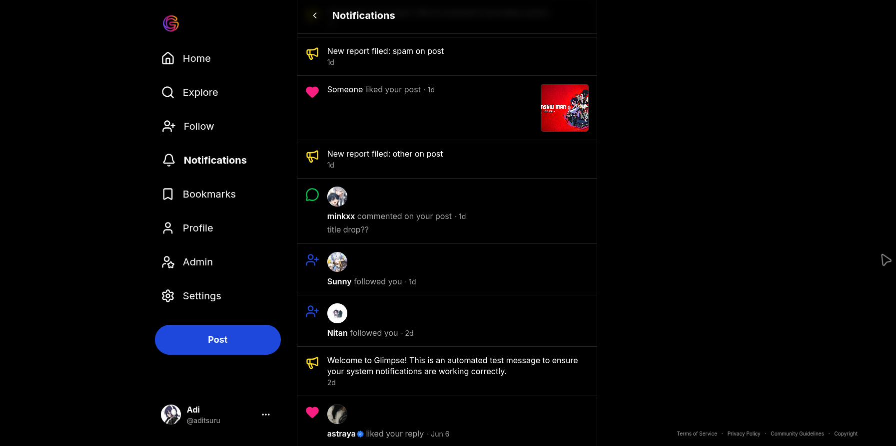
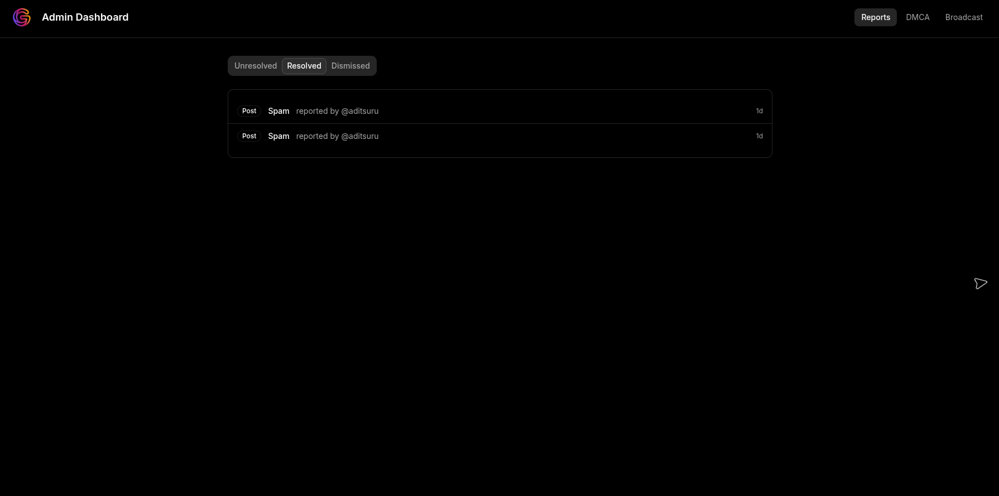

# Glimpse

<div align="left">

[][stars-url]
[][discord-url]


</div>

<div align="center">


</div>

<div align="center">

[][live-url]

</div>

Glimpse is a solo, full-stack portfolio project — a social platform built end-to-end to see how far I could take the boring-but-necessary parts most feed-app tutorials skip: a real trending algorithm, a notification system that actually groups activity instead of spamming you, and the moderation/legal plumbing (reports, bans, DMCA intake) that any public platform eventually needs whether you plan for it or not.

Posts support Markdown-style bodies, spoiler tags, and image/GIF/video carousels. Comments are threaded one level deep. Every interaction — likes, comments, follows, replies — feeds into a real-time notification system that stacks repeated activity into a single card instead of flooding your inbox. The trending feed is backed by a Redis sorted set that nudges live on every interaction and fully recomputes on a schedule, so ranking stays fresh without hammering Postgres on every request.

### Tech Stack

#### Frontend

[](https://nextjs.org)
[](https://www.typescriptlang.org)
[](https://tailwindcss.com)


[](https://ui.shadcn.com)

#### Backend


[](https://better-auth.com)


#### Database & Cache

[](https://www.postgresql.org)
[](https://orm.drizzle.team)
[](https://upstash.com)

#### Storage & Jobs


[](https://upstash.com/docs/workflow)

---

<div align="center">



</div>

### Features

- Two feeds: a chronological following feed and a Redis-backed trending feed with live score nudges + scheduled decay
- Unseen-first post ordering, with already-seen posts pushed to the bottom instead of hidden
- Cursor-based infinite scroll everywhere — no offset pagination, no duplicate posts on shifting ranks
- Threaded comments (one level deep), likes on both posts and comments
- Follows with public/private accounts, follow requests, and accept/reject flow
- Grouped notification system — repeated likes/comments/follows collapse into one card instead of spamming the feed
- Direct-to-S3 uploads via presigned URLs, no file ever touches the app server
- User reporting on posts, comments, and profiles, with categorized reasons
- Admin dashboard to review reports, take down content, and ban users (temporary or permanent)
- DMCA takedown intake with the fields actually required for a legally valid notice
- Platform-wide broadcast announcements from the admin panel
- Rate limiting on the API layer to keep abuse and runaway loops from taking down the database
- Dynamic sitemap, robots.txt, and PWA manifest so the app installs like a native app on mobile

### How the Feed Works

**Following feed** — straightforward chronological ordering from people you follow, with one twist: posts you've already seen (tracked via Redis + a Postgres fallback) get pushed to the bottom of each page instead of disappearing, so nothing gets lost if you're catching up after a while.

**Trending feed** — ranked by a decay score kept live in a Redis sorted set:

```
Score = (1 + Views × 0.5 + Likes × 2 + Comments × 4) / (AgeHours + 2)^1.2

```

Every like, comment, or view nudges a post's score immediately via `ZINCRBY`, so the feed feels responsive without a full recompute on every interaction. A scheduled job recalculates the full formula from Postgres and atomically swaps it into place — so the feed is never mid-rebuild or briefly empty. Pagination uses a `(score, id)` cursor instead of an offset, which avoids the classic bug where a shifting score duplicates or skips a post between page loads.

View counts themselves are batched in Redis as users scroll and flushed to Postgres by a nightly job that renames each user's pending history key before writing — so a failed write never silently drops views that were already counted.

<div align="center">



</div>

### Trust & Safety

The parts of a real platform that don't show up in a demo but matter the moment real people use it:

- **Reports** — any post, comment, or profile can be reported with a categorized reason; admins review, resolve, or dismiss from a dashboard, with the reporter notified either way
- **Bans** — temporary suspensions keep an account's content visible but lock them out; permanent bans delete the account entirely and block the email from re-registering
- **DMCA** — a dedicated intake form collecting what's actually legally required for a valid takedown notice (claimant identity, described work, infringing URL, a signed good-faith statement), separate from casual in-app reports
- **Moderation actions notify affected users** — content removal and bans both trigger a notification explaining what happened, instead of a silent disappearance

<div align="center">



</div>

### What I Learned

- Why offset pagination breaks on any feed with a live-changing sort order, and how to design a cursor around a mutable score instead of a mutable position
- Building a real-time-ish ranking system with Redis sorted sets — live nudges for responsiveness, scheduled full recomputation for correctness, and an atomic swap so the feed never serves stale or empty data mid-rebuild
- Designing a notification system that groups repeated activity into a single row instead of one row per event, and the tradeoffs in deciding what "resolves" a notification versus what creates a new one
- The gap between "auth-gated by default" (how most app scaffolding starts) and "public by default, gated for interaction" (how social platforms actually work) — and how expensive that assumption is to change after the fact
- That session cookies can outlive the database row they represent, and why "ban a user" is a harder problem than a single `DELETE` statement
- Structuring a growing oRPC API across dozens of modules with shared Zod schemas, without the frontend and backend contracts drifting apart

[stars-url]: https://github.com/aditsuru/glimpse/stargazers
[discord-url]: https://discord.gg/HP2YPGSrWU
[live-url]: https://glimpse.aditsuru.com
