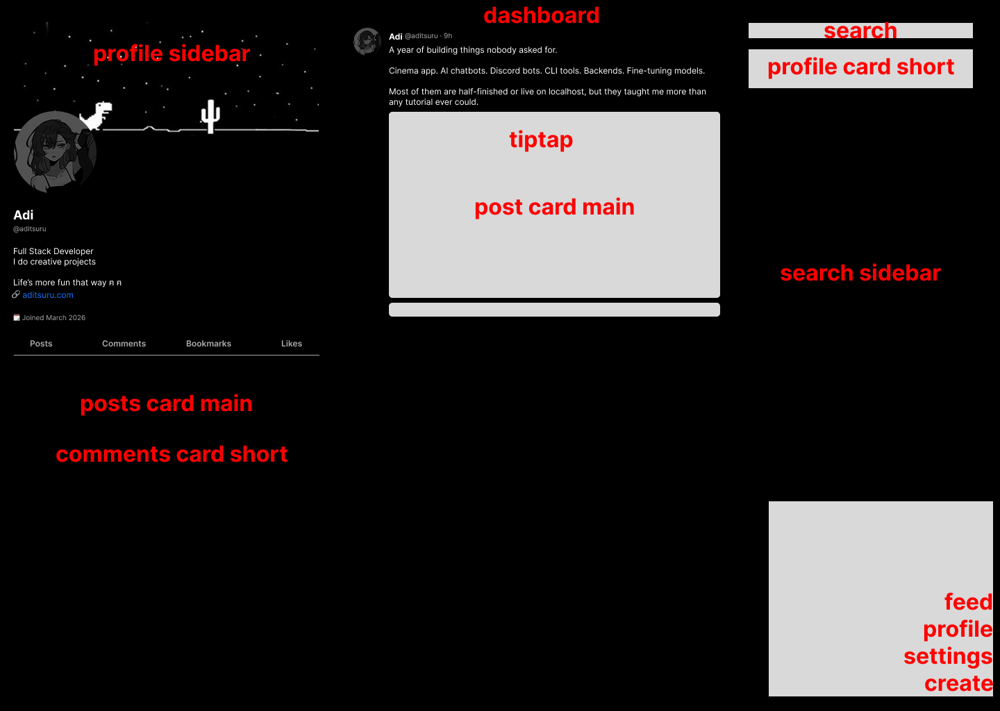

# Frontend pages

## Homepage and Layout

1. homepage - `/`

- `/` will be the feed and optionally support search query, the search query will be for searching "text" content in all posts.

2. profile

- displays a user's profile and posts
- Or if user's own profile, provide edit options

3. create

- create a new post

4. settings
5. post
6. search - mobile only
